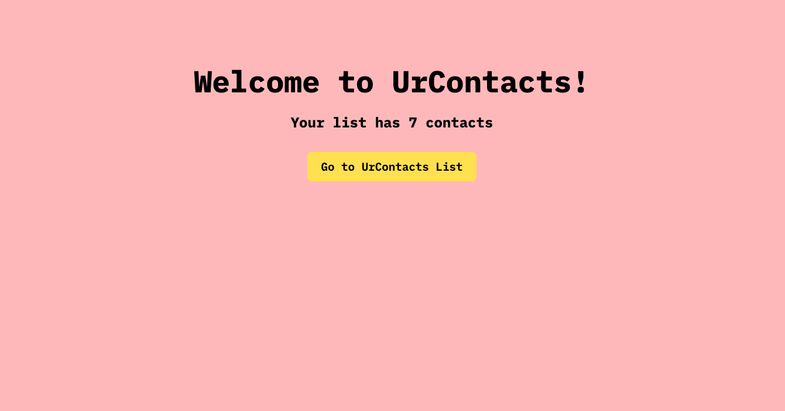
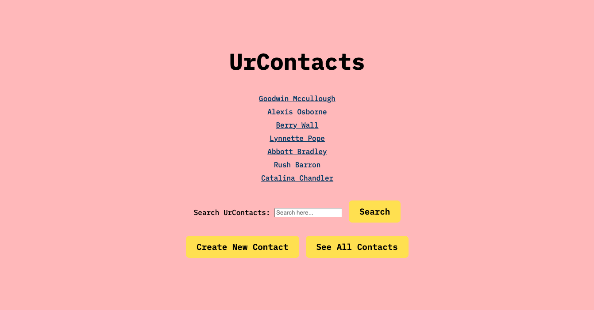
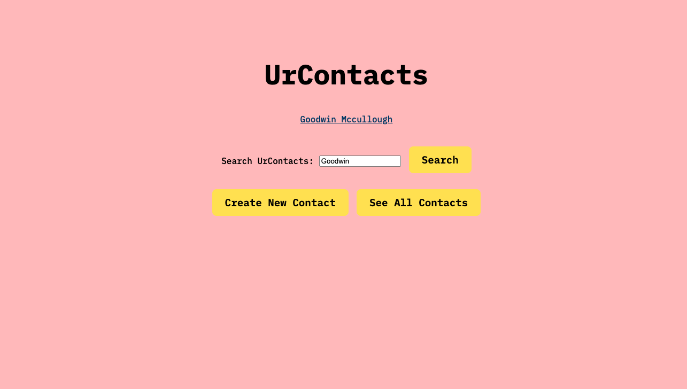
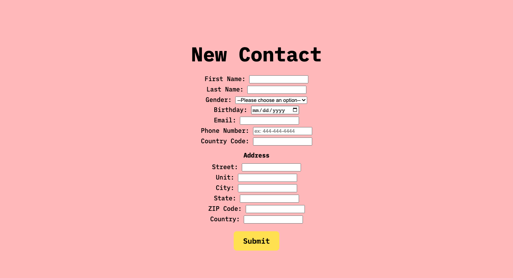
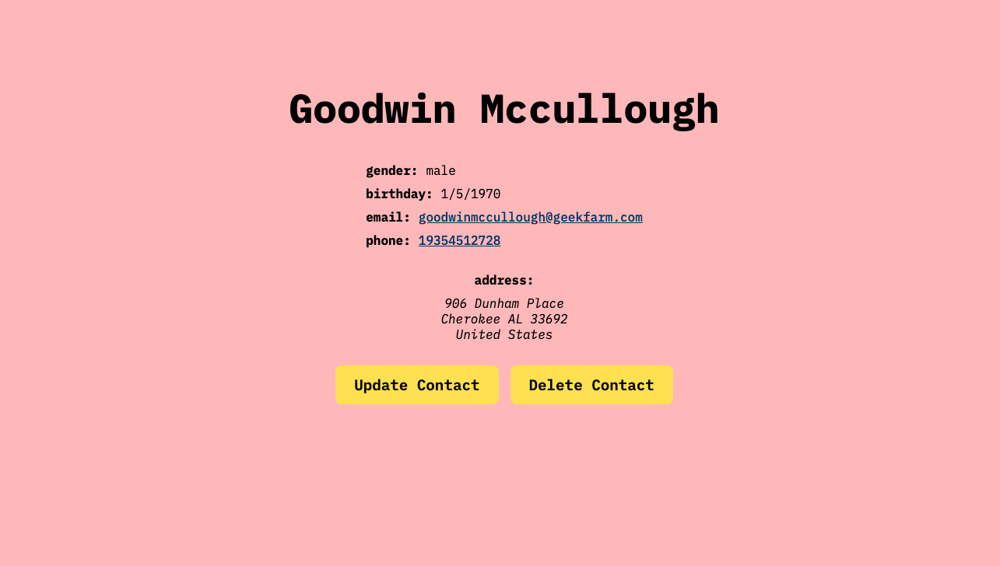
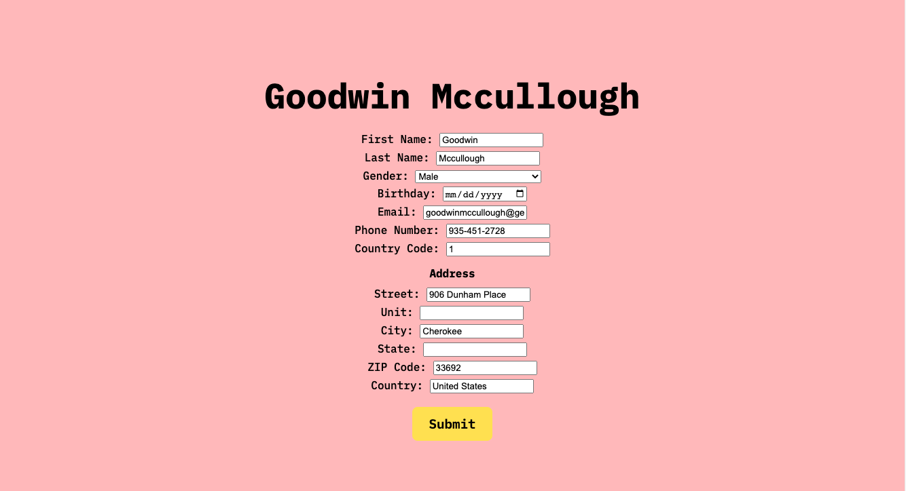

# UrContacts
> A contact list application

UrContacts is a React contact list app built with full CRUD capabilities. It uses json-server to locally store your data in a JSON file at the backend. Because your data persists on a locally hosted database, your data is completely private.

## Installation and Build

1. Clone or download GitHub repo into a desired local root directory.

2. `npm install` in the project directory.

3. `npm run build`

4. `npm start`

5. App will be running at port 3000 and can be accessed at http://localhost:3000

## Information

UrContacts provides functionality for creating, updating, deleting, and searching for contacts in a list stored as a JSON file on a locally hosted json-server. The app uses async calls to the json-server using the fetch API, and data that you add, update, or delete persist in the json-server in the `db.json` file. The app uses the React Router library to create routes to different application features while maintaining a single-page application experience.

### Technologies Used
- [React][react]
- [TypeScript][typeScript]
- [Vite][vite]
- [React Router][reactRouter]
- [json-server][json-server] 

## User Experience
    UrContacts uses React Router to route to various URLs in on your browser: 

    /                               => Home page
    /contacts                       => contact list
    /contacts/:contactID           => contact by id
    /create                         => create new contact
    /contacts/:contactID/update    => update contact
### Home Page `/`
- From the home page, you will be able to see how many contacts are currently in your list.
- If there are no contacts, you will be prompted to create a new contact. 
- Click on **Go to UrContacts List** to view your contact list (`/contacts`). 

### Search for Contact
- Type into the **Search UrContacts** field at the bottom of the contact list page. 
- Click **Search** button to change the results displayed.
- Click **See All Contacts** to reset the search and see all contacts.

### Create a New Contact `/create`
- Click on **Create New Contact** in the lower left corner of the contact list page. 
- A form will then appear to fill and submit.
- Complete and submit the form and your new contact will appear in your list.

### Contact Details `/contacts/:contactID`
- Click a contact's name to view a page with their contact information.

### Delete Contact
- On the Contact Details page, click **Delete Contact**.

### Update Contact `/contacts/:contactID/update`
- Click on the **Update Contact** link. 
- This will open the update form. 
- Edit the desired fields.
- Click **Submit** to save your changes.

## Release History

* 1.0.0
    * First major release

## Meta

Dara Yazdani 
dara.s.yazdani@gmail.com

<https://github.com/dyazdani/>

## Contributing

1. Fork it (<https://github.com/dyazdani/contact-list/fork>)
2. Create your feature branch (`git checkout -b feature/fooBar`)
3. Commit your changes (`git commit -am 'Add some fooBar'`)
4. Push to the branch (`git push origin feature/fooBar`)
5. Create a new Pull Request

<!-- Links for technologies -->
[react]: https://react.dev
[reactRouter]: https://reactrouter.com/en/main
[typeScript]: https://www.typescriptlang.org/id/download
[vite]: https://vitejs.dev/guide/
[json-server]: https://github.com/typicode/json-server